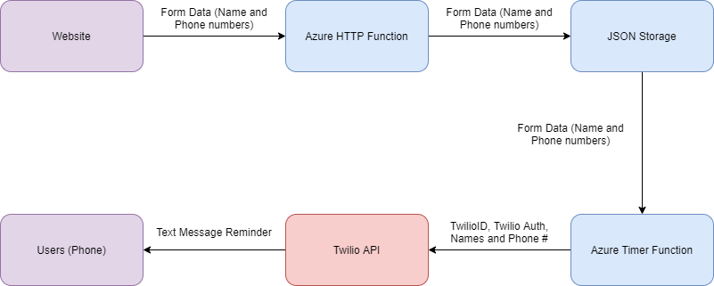
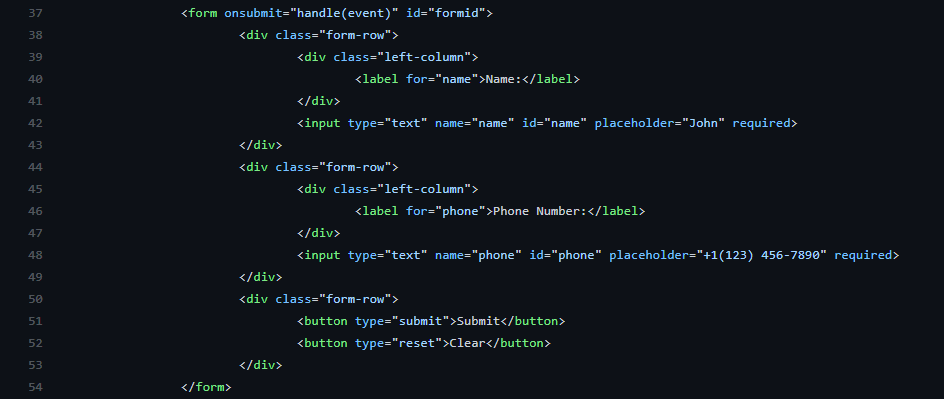
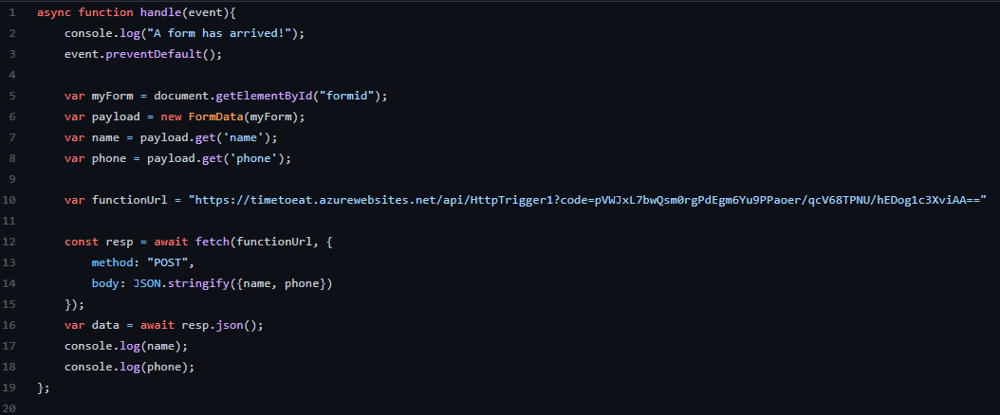
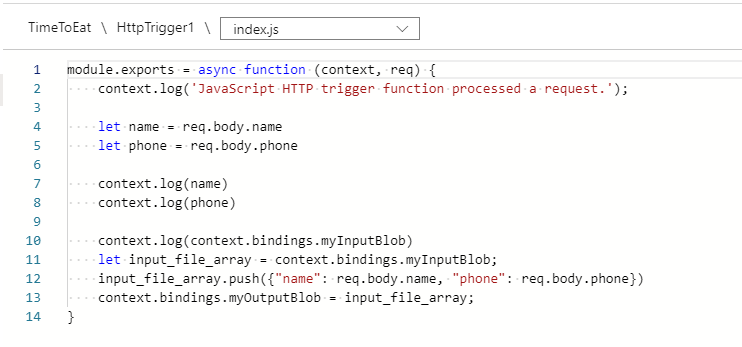
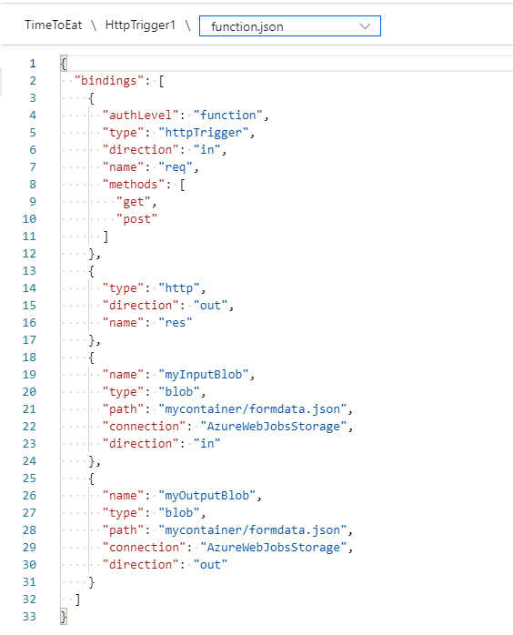
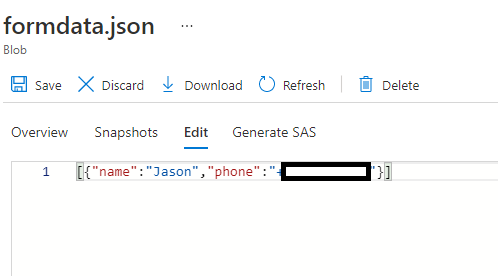
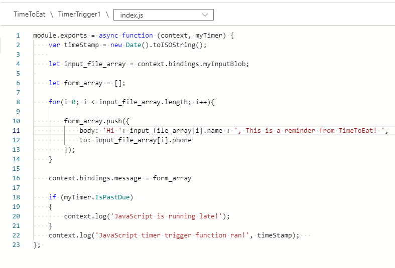
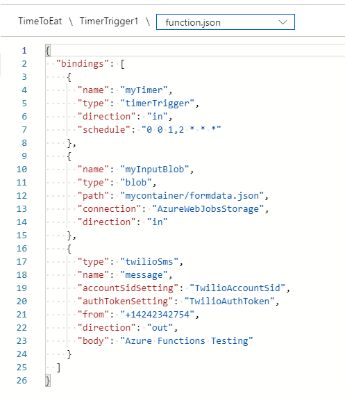
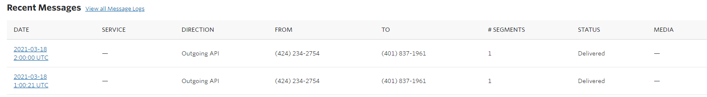

# TimeToEat!
###  Get notification reminders for proper eating habits!

## Who am I?
My name is Jason Wu and at this moment, I'm a Sophmore at the University of Rhode Island studying CS. I love food, lifting weights, skincare, video games, honestly anything you can think of, I like!

Because of lockdown, I haven't been outside to do anything for the past 10 months. Seriously. Nothing. No resturants, gym, not even boba. I love to eat and workout, but not being to do the ladder during quarentine, I've gained weight and have been eating late at night as well. I would order food just to keep my sanity alive if I'm at home all day. 

But I am determined to go back to my old self! I want to control what I eat and go back to exercising!
Thats why I created this application, TimeToEat to help me with diets and fasting (Intermitted Fasting more specifcally)!

## What is TimeToEat?
TimeToEat is a web application that gives you daily reminders for you to start or stop eating at specific times of the day through SMS messages. Currently, the application is set to remind you daily at 12PM and 6PM PST.
The app will take your name and phone number, sent to a trigger function in Microsoft Azure, and it will be stored in an Azure storage account. Then it's scheduled to send the reminder at those time through the Twilio API and send you a text with a personalized message.

## Frontend 
During my frontend development, I created a website from scratch with HTML. I decided to not use a template because I have never created a website and wanted to go on a journey of making one for the first time. Although it does not have much CSS and JS for the design and fun animations, I wanted to learn that step by step in the future. For my application, I needed to make a form to users to input their names and phone numbers. I did this in my main **index.html** file.

After getting the data from the form, I sent it into the frontend javascript file. In this file, it first waits for the form data to be send there. Once received, the form data will then have all the inputs recognized by name within the script. Then the Azure function script was called to be triggered. (More about Azure function in Backend!)
Finally, the name and phone data will be sent to the Azure URL. All this is located in the **index.js** file.

When my frontend was functional, I decided to use Azure and deploy it with GitHub and Static Web App. Then I went on towards the backend development.
## Backend
Within the backend, I mentioned that I used Microsoft Azure. The form data from my frontend would be sent into a Azure HTTP Trigger Function. In Microsoft Azure, development of anything requires some steps. It requires you to have an Azure subscription, resource group and then you can make a function app. 

### HTTP Trigger Function
This function will trigger when we call it, which we did in the **index.js** file. It will take the form data we sent through the URL in the parameters earlier and then add it into a Javascript Object Notation or JSON file.

 Our **formdata.json** will store the form data for all the users.
 
 

### Timer Trigger Function
The timer trigger function does what it sounds like. The function will trigger on a timer. For our application, we wanted to send notifications to users on a specific time each day. This timer functon will first read all the data in the **formdata.json** file and then add it into an array. When all the data is in the array, the function will then loop everything in the array and send the information to the Twilio API to send the SMS message.

### Twilio backend
In the Twilio application that we used, we created a Twilio account and received an API URL, a ID and authentication token. We needed to put all this information within the timer function's json file. Because I used a Twilio trial account, the application is only limited to send SMS messages to Twilio verified phone numbers. 

## The Future
For future development plans, I want to add tons of new features. Heres a list.
 - Selecting which time zone you are in
 - Picking what time(s) to receive the SMS messages
 - Available to non-Twilio verified phone numbers
 - More frontend development (Design, Exceptions, Confirmation page)

But untill then, this web application will help me towards a scheduled and healthy diet!

## Thanks!
I apprecate your time for checking out my web app! This project would not be possible without the help of my mentor Ankit, and all the instructors and the team of Bit Project Serverless BitCamp which was cohosted by Microsoft. I had many ideas, some even scrapped, but this whole experience creating this was super entertaining and learned so much. Once again, Thanks!
